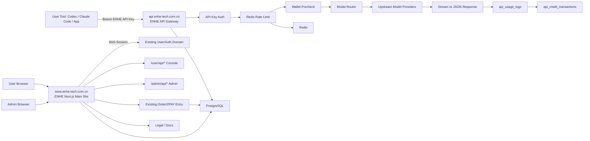

# ENHE API Gateway Architecture

Date: 2026-07-05

Status: Phase 2 architecture draft

## 1. 架构结论

ENHE API Gateway 采用混合架构。

- 现有 ENHE 主站继续承载公开页、用户控制台、支付、后台、法律条款和文档中心。
- 独立 `api.enhe-tech.com.cn` Gateway 服务承载 `/v1/*` 运行时接口。
- 主站和 Gateway 共享 PostgreSQL 数据库，但 Gateway 只能访问 API 相关表和必要用户状态。
- Gateway 不读取主站 Web Session，不信任浏览器 Cookie，只校验 ENHE API Key。
- Gateway 使用 Redis 处理短窗口限流、消费窗口、反滥用计数和临时运行时状态。
- 上游模型供应商密钥只存在 Gateway 服务端或密钥管理系统，不进入主站前端、用户控制台或日志。

该结论延续阶段 0 的 Option C：主站复用现有账号、支付、后台、法律能力；运行时请求从 Next.js 主站进程中隔离出去，降低流式响应、高并发、上游故障和成本风险。

## 2. 系统边界

| 系统 | 职责 | 不负责 |
| --- | --- | --- |
| ENHE 主站 `www.enhe-tech.com.cn` | `/ai-api`、`/ai-api/pricing`、`/ai-api/docs`、`/user/api/*`、`/admin/api/*`、登录 Session、订单支付入口、法律条款、用户中心、管理后台 | 不承载生产 `/v1/*` Gateway 热路径，不保存上游供应商密钥 |
| ENHE API Gateway `api.enhe-tech.com.cn` | `/v1/models`、`/v1/chat/completions`、`/v1/messages`、API Key 鉴权、限流、余额检查、模型路由、流式代理、usage log、扣费流水 | 不处理主站 Web Session，不提供营销页、登录页、支付页、后台 UI |
| PostgreSQL | 用户身份主数据、API 开发者资料、API Key hash、模型路由、钱包、扣费流水、请求日志、支付映射、审计数据 | 不承载高频短窗口限流计数，不保存完整 API Key |
| Redis | 每分钟/每小时限流、5 小时/7 天消费窗口、请求去重短缓存、异常消耗临时计数 | 不作为最终账本，不作为唯一扣费依据 |
| 上游模型供应商 | 模型推理、token 统计、流式返回、供应商侧错误 | 不直接面向 ENHE 用户暴露凭据，不处理 ENHE 余额 |
| ZPAY/支付系统 | 支付下单、回调通知、退款能力、支付状态证明 | 不直接修改 API 钱包余额；余额发放必须通过 ENHE 幂等流水 |

## 3. 请求链路

运行时请求链路：

1. 用户工具调用 `api.enhe-tech.com.cn/v1/...`。
2. Gateway 生成或读取 `request_id`。
3. Gateway 从 `Authorization: Bearer <ENHE_API_KEY>` 读取 API Key。
4. Gateway hash API Key，查询 `api_keys`，只接受 active 且未 revoked 的 Key。
5. Gateway 读取用户和 `api_developer_profiles` 必要状态，拒绝冻结用户。
6. Gateway 根据 IP hash、user_id、api_key_id、model、path、套餐等级执行 Redis 限流。
7. Gateway 进行余额预检查和单请求最大成本检查。
8. Gateway 查询 `api_model_routes`，选择公开模型对应的上游 provider 和模型。
9. Gateway 调用上游 provider。
10. `stream=true` 时 Gateway 逐块转发；`stream=false` 时等待完整响应。
11. 请求结束后 Gateway 写入 `api_usage_logs`。
12. 可计费请求在同一结算流程中写入 `api_credit_transactions` 并更新 `api_wallets`。
13. 用户在主站 `/user/api/logs` 和 `/user/api/usage` 查看日志与余额变化。

## 4. 用户控制台链路

用户控制台链路：

1. 用户浏览器访问 `www.enhe-tech.com.cn`。
2. 主站使用现有登录 Session 校验用户身份。
3. 用户进入 `/user/api`。
4. 主站检查或初始化 `api_developer_profiles`。
5. 用户进入 `/user/api/keys` 创建、查看前缀、撤销 API Key。
6. 用户进入 `/user/api/usage` 查看余额和扣费流水。
7. 用户进入 `/user/api/logs` 查看请求日志。
8. 用户进入 `/user/api/billing` 购买套餐或充值。
9. 用户进入 `/user/api/referrals` 查看推荐奖励。

控制台必须使用主站 Web Session；控制台不得要求用户粘贴完整 API Key 才能查看自己的日志或余额。

## 5. 管理后台链路

管理后台链路：

1. 管理员访问 `/admin/api`。
2. 主站复用现有 `requireAdmin` 类管理员权限门禁。
3. 管理员可查看 API 用户、Key 前缀、日志、钱包、模型、订单、推荐和审计。
4. 管理员可冻结用户、撤销 Key、调整余额、关闭模型、补发额度。
5. 每个关键动作写入 `api_admin_audit_logs` 或复用现有 admin audit 体系的 API target type。
6. Gateway 在每次运行时请求读取用户/API 状态，确保冻结、撤销、关闭模型及时生效。

## 6. MVP 架构图

## 7. 共享数据库访问原则

Gateway 可读写范围：

- 可读：`api_keys`、`api_developer_profiles`、必要 `users.status`、`api_wallets`、`api_model_routes`、`api_provider_accounts` 的非密钥元数据、`api_rate_limit_policies`。
- 可写：`api_usage_logs`、`api_credit_transactions`、`api_wallets` 扣费字段、`api_gateway_idempotency_keys`、`api_rate_limit_windows` 兜底记录。
- 不读：`sessions`、主站 Cookie、支付证明图片、非 API 业务内容。
- 不写：主站订单核心状态，除非通过明确的 API 支付映射流程。

主站可读写范围：

- 可读写 API 控制台和后台所需的 API 表。
- 可写 API Key 创建/撤销、开发者资料、套餐订单映射、管理员调整、模型启停。
- 不保存完整 API Key。
- 不保存上游 provider 明文密钥到前端可见配置。

## 8. Phase 2 架构演进

| 能力 | 演进方向 | 前置条件 |
| --- | --- | --- |
| 多供应商 fallback | `api_model_routes` 增加优先级、权重、fallback group；Gateway 按错误类型切换 | Provider 合规确认、幂等扣费、错误分类 |
| 上游失败重试 | 对网络超时、5xx、限流等可重试错误做有限重试 | request_id 幂等、流式中断策略 |
| 服务状态页 | 主站 `/ai-api/status` 展示 Gateway、模型、provider 和事件状态 | 健康检查、事件记录、公开状态分级 |
| 成本告警 | Redis/日志聚合触发用户和管理员成本告警 | 钱包流水准确、通知通道可用 |
| 内容隐私开关 | 用户显式选择是否允许保存 prompt/completion 用于排障 | 法律条款、数据保留、访问权限 |
| 独立日志仓库或 ClickHouse | 高量 usage logs 从 PostgreSQL 冷热分层或同步到日志仓库 | 查询量增长、保留周期明确、同步可靠 |

## 9. 架构验收口径

- `/v1/*` 生产运行时不进入主站 Next.js 进程。
- Gateway 不读取 Web Session。
- 主站与 Gateway 对 API Key、用户状态、钱包、日志和模型路由有一致数据契约。
- 余额不足在上游调用前拦截。
- 成功可计费请求能追溯到 request id、usage log 和扣费流水。
- 管理员冻结用户、撤销 Key、关闭模型能影响 Gateway 运行时请求。

