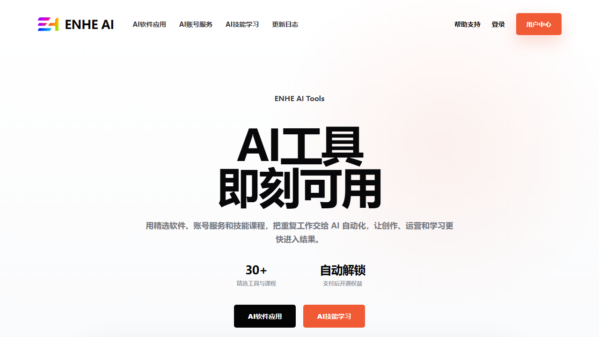
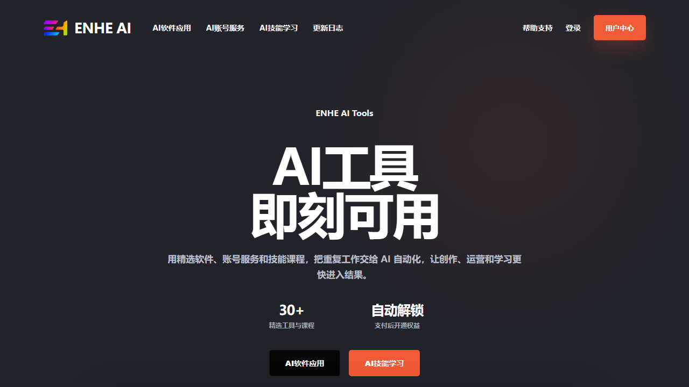

# ENHE AI 首页 UI 升级设计说明

日期：2026-06-17  
状态：已确认视觉方向  
适用范围：首页首屏、顶部导航、首页推荐区视觉基调。后续可延展到工具列表和工具详情页。

## 1. 设计目标

本次 UI 升级将 ENHE AI 首页从当前深色 HUD 科技感，调整为更接近现代 SaaS 官网的高留白、强标题、强行动入口风格。

目标是让用户进入首页后立刻理解：

- ENHE AI 是 AI 软件、AI 账号服务、AI 技能学习的集合平台。
- 核心入口清晰：AI 软件应用、AI 技能学习、用户中心。
- 页面气质更干净、更可信、更像产品官网。
- 同一套结构支持白天模式和夜晚模式。

## 2. 参考图分析

用户提供的参考图核心特征：

- 白色或接近白色背景，大面积留白。
- 顶部导航轻量，品牌在左，链接横向展开，右侧有主按钮。
- Hero 内容居中，层级极少：小标题、超大主标题、指标、两个 CTA。
- 主标题使用超粗黑字，2 行以内完成表达。
- CTA 使用黑色主按钮和橙红色强调按钮。
- 底部露出产品界面或内容预览，暗示下方还有实际产品内容。

本方案保留以上页面语法，但替换为 ENHE AI 自身内容与 logo。

## 3. 视觉方向

设计读法：ENHE AI 的产品官网首页，面向希望购买 AI 软件、AI 账号服务和 AI 技能课程的中文用户。视觉语言为极简 SaaS 官网，使用高留白、强字体、少量暖色 CTA 和 ENHE 渐变 logo。

设计参数：

- 设计变化度：5/10，保持克制，不做复杂装饰。
- 动效强度：3/10，优先轻微 hover、淡入和产品预览浮动。
- 信息密度：3/10，首屏只放最关键的购买和浏览入口。

## 4. 白天模式

预览图：[enhe-light-saas-reference-preview.png](../../design/enhe-light-saas-reference-preview.png)

### 背景

- 页面背景使用纯白到极浅灰渐变。
- 右上区域可以保留极淡橙色光晕，透明度需要很低，只用于暖化页面。
- 不使用网格、粒子、赛博线框、HUD 轨道等当前暗色视觉元素。

建议颜色：

- 页面底色：`#ffffff`
- 底部浅灰：`#f7f8fa`
- 主文字：`#08080a`
- 次级文字：`#74777f`
- CTA 橙红：`#f05a35`
- 黑色按钮：`#050505`

### Logo

白天模式顶部使用附件 3 的白底渐变 logo，并裁切掉 1024 画布中的大留白。

项目预览资产：

- 裁切图标：[enhe-icon-gradient-white-bg-cropped.png](../../design/enhe-icon-gradient-white-bg-cropped.png)

导航中 logo 建议尺寸：

- 图标显示宽度：`46px`
- 图标显示高度：`30px`
- 图标与 `ENHE AI` 字样间距：`12px`
- 品牌文字大小：`26px`
- 品牌文字字重：`800`

## 5. 夜晚模式

预览图：[enhe-dark-saas-reference-preview.png](../../design/enhe-dark-saas-reference-preview.png)

### 背景

夜晚模式使用用户提供附件 1 的深色基调，接近 `#22242a`。

建议颜色：

- 页面背景：`#22242a`
- 深色渐变底：`#202229`
- 主文字：`#ffffff`
- 次级文字：`#b9bec9`
- 导航文字：`#f3f4f7`
- CTA 橙红：`#f05a35`
- 黑色按钮：`#050505`

### Logo

夜晚模式顶部使用附件 2 的透明渐变 logo，并裁切掉透明留白。

项目预览资产：

- 裁切图标：[enhe-icon-gradient-transparent-cropped.png](../../design/enhe-icon-gradient-transparent-cropped.png)

导航 logo 显示尺寸与白天模式一致：

- 图标显示宽度：`46px`
- 图标显示高度：`30px`
- 图标使用 `object-fit: contain`

## 6. 顶部导航规格

导航结构：

1. 左侧：ENHE 渐变 logo + `ENHE AI`
2. 中间：`AI软件应用`、`AI账号服务`、`AI技能学习`、`更新日志`
3. 右侧：`帮助支持`、`登录`、`用户中心`

重要决策：

- 右上主按钮文案固定为 `用户中心`，不使用 `查看工具`。
- 桌面导航高度控制在 80px 以内。
- 导航链接不使用下划线和重装饰，hover 时只做轻微透明度或颜色变化。
- 移动端可折叠菜单，但首屏必须保留品牌和用户中心入口。

## 7. Hero 首屏规格

### 内容

首屏文本建议：

- Eyebrow：`ENHE AI Tools`
- H1：`AI工具` 换行 `即刻可用`
- 描述：`用精选软件、账号服务和技能课程，把重复工作交给 AI 自动化，让创作、运营和学习更快进入结果。`

CTA：

- 黑色按钮：`AI软件应用`
- 橙红按钮：`AI技能学习`

指标：

- `30+`，标签：`精选工具与课程`
- `自动解锁`，标签：`支付后开通权益`

### 装饰约束

已确认取消以下装饰：

- 黑色稻穗
- 炫彩圆弧形边框
- 指标两侧的任何括号式、枝叶式、圆环式装饰

指标区保持纯文字，靠排版和间距建立可信感。

### 字体与排版

桌面端：

- H1 字号：`68px` 到 `96px`
- H1 行高：`0.98`
- H1 字重：`900`
- H1 字距：约 `-0.045em`
- 描述最大宽度：`660px`
- 描述字号：`17px`
- 描述行高：`1.75`

移动端：

- H1 字号约 `48px` 到 `56px`
- CTA 可以上下排列或保持双按钮横向滚动，优先不换行。
- 指标区可以纵向排列。

## 8. 产品预览区

首屏底部保留一个露出的产品预览框，作用是暗示下方有真实工具内容。

白天模式：

- 卡片背景：白色或极浅灰。
- 边框：`rgba(12, 12, 14, 0.08)`
- 阴影：轻柔，不能像浮夸卡片。

夜晚模式：

- 卡片背景：`#262932` 或半透明白色叠层。
- 边框：`rgba(255,255,255,0.1)`
- 内部线条使用低透明白。

实现时推荐把该预览替换为真实内容：

- 推荐工具卡片缩略预览。
- 后台工具编辑图文样张。
- 用户中心权益列表预览。

不要长期保留纯线框假界面作为最终上线素材。

## 9. 与当前项目的适配说明

当前项目相关文件：

- 首页：[src/app/page.tsx](../../../src/app/page.tsx)
- 全局样式：[src/app/globals.css](../../../src/app/globals.css)
- 顶部导航：[src/components/site-header.tsx](../../../src/components/site-header.tsx)
- 工具卡片：[src/components/tool-card.tsx](../../../src/components/tool-card.tsx)

当前首页是深色 HUD 风格，包含轨道、信号、玻璃卡片和深色背景。正式升级时建议做以下处理：

- 首页首屏替换为本说明的 SaaS 极简结构。
- `HeroLogoMark` 当前偏大型标志展示，首屏可取消或降级到产品预览区。
- `InteractiveBackground` 在白天模式应关闭或改为极淡背景光。
- `ToolCard` 后续需要同步浅色化和夜晚模式双主题，否则首页首屏与推荐区风格会断裂。
- `globals.css` 中大量暗色变量需要抽象为 theme token，避免直接覆盖导致后台和用户中心失真。

## 10. 实施优先级

第一阶段：首页首屏和导航

- 替换导航 logo。
- 调整导航文案和右侧按钮为 `用户中心`。
- 新建白天/夜晚主题 token。
- 首页首屏改为居中巨型标题。
- 移除当前首页首屏的轨道和信号装饰。

第二阶段：首页推荐区

- 将推荐工具区改为浅色/夜晚双主题卡片。
- 使用真实工具封面和价格标签。
- 保留现有 `ToolCard` 数据结构，不改变 Prisma 查询。

第三阶段：全站延展

- 软件列表、账号服务列表、课程列表同步新卡片语言。
- 工具详情页同步顶部 hero、购买按钮和产品图区域。
- 后台管理界面暂不跟随该营销页风格，避免运营界面可读性下降。

## 11. 验收标准

- 白天模式与夜晚模式都有完整可用首屏。
- 顶部 logo 尺寸正确，不出现 1024 画布留白导致的小图标问题。
- 夜晚模式使用附件 2 透明 logo，白天模式使用附件 3 白底 logo。
- 右上按钮显示 `用户中心`。
- 指标区两侧没有稻穗、圆弧或其他装饰。
- 首屏 CTA 在 1280px 桌面视口内可见。
- 移动端文字不溢出，按钮文案不换成两行。
- 不改变现有路由结构和后台业务流程。

## 12. 已确认图例

白天版：

夜晚版：

